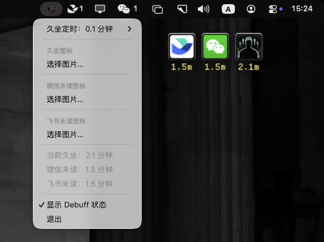

# debuff（久坐计时 + 微信/飞书 消息未读 + 语音输入）

macOS 原生小工具：启动后出现**设置窗口**，可在其中调节久坐阈值与 debuff 图标。计时从启动或清除 debuff 后开始；超过阈值后出现仿魔兽风格的 **debuff 浮窗**：外框使用资源 **`border.png`**，技能图默认使用 **`sentinel-juggernautstance-128.png`**（可被用户自选图片覆盖）。图标下方为计时（分钟，一位小数 + `m`）。**双击** debuff 浮窗可清除状态并重新计时。

另外内置**语音输入**：按下全局快捷键打开系统默认麦克风录音，本地静音检测分段，调用本地 OpenAI 兼容的 STT 服务转写，并把文字粘贴到当前光标位置（支持「边说边粘」）。

## 软件说明（界面截图）

下图为本工具运行效果示意：含设置窗口、桌面上的 **debuff 浮窗**（外框、图标与计时时长）等。



配置项：

- **久坐多久后出现 debuff**：数值选项
- **自定义 debuff 图标**：选择本地图片；「恢复默认」即重新使用包内 `sentinel-juggernautstance-128.png`。

## 资源文件

外框与默认图标位于 `Sources/SedentaryDebuff/Resources/`：

| 文件 | 用途 |
|------|------|
| `border.png` | debuff 浮窗外框（叠放图标与计时文字） |
| `sentinel-juggernautstance-128.png` | 默认 debuff 图标 |

可自行替换同名文件后重新编译；请保持文件名不变。

## 环境要求

- macOS 13 或更高版本  
- [Swift](https://www.swift.org/) 5.9+（随 Xcode 或 Command Line Tools 安装）

## 使用命令行编译与运行

在项目根目录（含 `Package.swift` 的目录）执行：

```bash
cd /path/to/debuff
swift build -c release
```

运行 Release 构建产物：

```bash
./.build/release/SedentaryDebuff
```

调试构建可直接：

```bash
swift run SedentaryDebuff
```

首次运行若出现来自未签名本机工具的 Gatekeeper 提示，可在「系统设置 → 隐私与安全性」中按需允许，或在右键菜单中选择打开。

## 使用 xcodebuild 编译

在含 `Package.swift` 的项目根目录执行（需安装 **Xcode**；`xcodebuild` 位于 Xcode 自带的命令行工具中）。

**Release 构建：**

```bash
cd /path/to/debuff
xcodebuild \
  -scheme SedentaryDebuff \
  -destination 'platform=macOS' \
  -configuration Release \
  build
```

**Debug 构建：** 将上面的 `-configuration Release` 改为 `-configuration Debug` 即可。

**产物位置：** 默认写入 Xcode 的 DerivedData，路径类似  
`~/Library/Developer/Xcode/DerivedData/debuff-<随机后缀>/Build/Products/Release/`。  
其中主程序为 **`SedentaryDebuff`**（可执行文件）；同目录还有资源包 **`SedentaryDebuff_SedentaryDebuff.bundle`**。运行或拷贝分发时，请保持可执行文件与该 `.bundle` **位于同一目录**（或直接分发整个 `Release` 目录）。

**把构建输出固定到仓库内**（便于查找，不依赖 DerivedData 随机目录名）：

```bash
cd /path/to/debuff
xcodebuild \
  -scheme SedentaryDebuff \
  -destination 'platform=macOS' \
  -configuration Release \
  -derivedDataPath "$(pwd)/.xcodebuild/DerivedData" \
  build
```

编译成功后，可从终端启动：

```bash
open .xcodebuild/DerivedData/Build/Products/Release/SedentaryDebuff
```

**打包为标准 `.app`（可拖入「应用程序」）：** 在项目根目录执行：

```bash
./scripts/package-macos-app.sh
```

成功后得到 `dist/debuff.app`（`dist/` 已加入 `.gitignore`）。安装示例：

```bash
cp -R dist/debuff.app /Applications/
```

脚本会 `swift build -c release`，将可执行文件与 SPM 资源包放入 `Contents/MacOS/`，并写入 `App/Info.plist`；为资源包补全 `App/ResourceBundle-Info.plist` 以便 **ad-hoc 代码签名**（`codesign -s -`）。若需对外分发并通过 Gatekeeper，仍需在 Xcode 中 **Archive** 或使用 Apple 开发者账号做公证（Notarization）。

## 使用 Xcode 编译与运行

1. 打开 Xcode，选择 **File → Open…**，选中本仓库中的 **`Package.swift`**（不要只选文件夹）。
2. 等待依赖解析完成后，在顶部 Scheme 中选择 **`SedentaryDebuff`**，运行目标为 **My Mac**。
3. 使用 **⌘R**（Product → Run）启动应用，在**设置窗口**中调节参数。

## 行为说明

- **计时起点**：应用启动时，或你 **双击 debuff 浮窗** 清除后。
- **浮窗计时**：从「久坐时间首次达到阈值」的时刻起算，展示为 `XX.Xm`（一位小数）。
- **配置持久化**：阈值与自定义图标路径保存在本机 `UserDefaults` 中。

## 语音输入

状态栏菜单新增「语音输入」区：默认快捷键 **⌥⇧F2**（可在菜单「语音输入 → 设置 → 快捷键」中更换，全局生效，不依赖窗口焦点）。

**使用方式**

1. 按快捷键开始录音（光标附近会出现圆角边框的**波形指示条**：一排竖条，说话时变长、静音时变短，随音量实时跳动）。
2. 说话；停顿达到设定时间（默认 1 秒）或单段达到最大时长（默认 10 秒）会自动切段。
3. 每段由本地 STT 服务转写后立即粘贴到**当前光标位置**（「实时/边说边粘」模式，默认开启）。
4. 再按一次快捷键结束，会把最后未粘贴的片段转写并粘贴，波形指示条同时消失。

**STT 服务地址**

- 可在菜单「语音输入 → 设置 → STT 服务地址」中配置，支持自定义 URL（OpenAI 兼容的 `POST /v1/audio/transcriptions`，multipart `file` 字段，返回 `{"text": "..."}`），默认 `http://127.0.0.1:8001/v1/audio/transcriptions`。
- 菜单「测试服务连接」可检测服务是否可用。
- 与本仓库配套的本地服务示例（funasr-llamacpp + FSMN-VAD，`--persistent` 常驻）见 `~/Desktop/foucs/funasr-llamacpp/`，启动命令见其 `README` / `start-funasr-server.sh`。

**权限要求（打包成 `.app` 后运行）**

- **麦克风**：首次使用时系统会弹出授权（对应 `NSMicrophoneUsageDescription`）。
- **辅助功能**：粘贴需模拟 ⌘V，未授权时会在系统设置中引导（对应 `NSAccessibilityUsageDescription`）。

> 注意：请使用 `./scripts/package-macos-app.sh` 打包的 `dist/debuff.app` 运行；直接用 `swift run` 跑裸可执行文件时，麦克风权限提示可能无法正常弹出。

