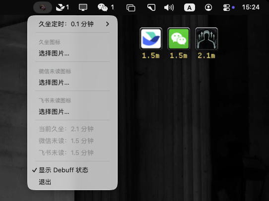

English | [简体中文](README.zh-CN.md)

# debuff (Sedentary Timer + WeChat/Feishu Unread + Voice Input)

A native macOS utility: on launch it shows a **settings window** where you can adjust the sedentary threshold and the debuff icon. The timer starts at launch or after you clear the debuff; once the threshold is exceeded, a Warcraft-style **debuff popup** appears: the frame uses the **`border.png`** asset, and the skill icon defaults to **`sentinel-juggernautstance-128.png`** (overridable with a user-chosen image). Below the icon is the timer (minutes, one decimal place, with an `m` suffix). **Double-click** the debuff popup to clear the state and restart the timer.

It also includes **voice input**: press a global hotkey to open the system default microphone, segment locally via silence detection, transcribe with a local OpenAI-compatible STT service, and paste the text at the current cursor position (with "paste as you speak" support).

## Screenshots

The image below shows the tool in action: the settings window and the **debuff popup** on the desktop (frame, icon, and elapsed time).



Settings:

- **Debuff after sitting for**: numeric option
- **Custom debuff icon**: choose a local image; "Restore default" returns to the bundled `sentinel-juggernautstance-128.png`.

## Assets

The frame and default icon live in `Sources/SedentaryDebuff/Resources/`:

| File | Purpose |
|------|---------|
| `border.png` | debuff popup frame (overlays the icon and timer text) |
| `sentinel-juggernautstance-128.png` | default debuff icon |

You can replace the files with the same names and rebuild; keep the file names unchanged.

## Requirements

- macOS 13 or later
- [Swift](https://www.swift.org/) 5.9+ (installed with Xcode or the Command Line Tools)

## Build and run from the command line

From the project root (the directory containing `Package.swift`):

```bash
cd /path/to/debuff
swift build -c release
```

Run the Release build:

```bash
./.build/release/SedentaryDebuff
```

For a debug build:

```bash
swift run SedentaryDebuff
```

On first launch, if Gatekeeper warns about an unsigned local tool, allow it under "System Settings → Privacy & Security" as needed, or open it from the right-click context menu.

## Build with xcodebuild

Run from the project root containing `Package.swift` (**Xcode** required; `xcodebuild` ships with Xcode's command line tools).

**Release build:**

```bash
cd /path/to/debuff
xcodebuild \
  -scheme SedentaryDebuff \
  -destination 'platform=macOS' \
  -configuration Release \
  build
```

**Debug build:** change `-configuration Release` above to `-configuration Debug`.

**Output location:** by default this writes to Xcode's DerivedData, at a path like
`~/Library/Developer/Xcode/DerivedData/debuff-<random-suffix>/Build/Products/Release/`.
The main program is **`SedentaryDebuff`** (the executable); the same directory also contains the resource bundle **`SedentaryDebuff_SedentaryDebuff.bundle`**. When running or distributing, keep the executable and that `.bundle` **in the same directory** (or distribute the whole `Release` directory).

**Pin the build output inside the repo** (easier to find, no random DerivedData directory):

```bash
cd /path/to/debuff
xcodebuild \
  -scheme SedentaryDebuff \
  -destination 'platform=macOS' \
  -configuration Release \
  -derivedDataPath "$(pwd)/.xcodebuild/DerivedData" \
  build
```

After a successful build, launch it from the terminal:

```bash
open .xcodebuild/DerivedData/Build/Products/Release/SedentaryDebuff
```

**Package as a standard `.app` (draggable into Applications):** from the project root:

```bash
./scripts/package-macos-app.sh
```

On success you get `dist/debuff.app` (`dist/` is in `.gitignore`). Example install:

```bash
cp -R dist/debuff.app /Applications/
```

The script runs `swift build -c release`, places the executable and the SPM resource bundle into `Contents/MacOS/`, and writes `App/Info.plist`; it also fills in `App/ResourceBundle-Info.plist` for the resource bundle so **ad-hoc code signing** (`codesign -s -`) works. To distribute publicly and pass Gatekeeper, you still need to **Archive** in Xcode or notarize with an Apple Developer account.

## Build and run with Xcode

1. Open Xcode, choose **File → Open…**, and select **`Package.swift`** in this repo (don't select just the folder).
2. Wait for dependency resolution, then pick **`SedentaryDebuff`** in the scheme selector at the top and set the run destination to **My Mac**.
3. Press **⌘R** (Product → Run) to launch the app and adjust settings in the **settings window**.

## Behavior

- **Timer start**: when the app launches, or after you **double-click the debuff popup** to clear it.
- **Popup timer**: counted from the moment sitting time first reaches the threshold, shown as `XX.Xm` (one decimal place).
- **Config persistence**: the threshold and custom icon path are stored in local `UserDefaults`.

## Voice input

The status bar menu adds a "Voice input" section: default hotkey **⌥⇧F2** (changeable under the menu "Voice input → Settings → Hotkey"; it's global and doesn't depend on window focus).

**How to use**

1. Press the hotkey to start recording (a rounded **waveform indicator bar** appears **next to the mouse**: a row of vertical bars that lengthen when you speak and shorten when silent, jumping in real time with the volume; the bar stays pinned beside the mouse and follows it).
2. Speak; a pause reaching the configured length (1 second by default) or a single segment reaching the maximum length (10 seconds by default) auto-segments.
3. Each segment is transcribed by the local STT service and pasted immediately at the **current cursor position** ("live / paste as you speak" mode, on by default).
4. Press the hotkey again to stop; the final un-pasted segment is transcribed and pasted, and the waveform indicator disappears.

**STT service URL**

- Configurable under the menu "Voice input → Settings → STT service URL"; a custom URL is supported (OpenAI-compatible `POST /v1/audio/transcriptions`, multipart `file` field, returning `{"text": "..."}`). Default: `http://127.0.0.1:8001/v1/audio/transcriptions`.
- The menu item "Test service connection" checks whether the service is reachable.
- A companion local service for this repo (funasr-llamacpp + FSMN-VAD, with `--persistent`): see `~/Desktop/foucs/funasr-llamacpp/` and its `README` / `start-funasr-server.sh`.

**Permissions (when running as a packaged `.app`)**

- **Microphone**: the system prompts for authorization on first use (via `NSMicrophoneUsageDescription`).
- **Accessibility**: pasting simulates ⌘V; if unauthorized, the app guides you to System Settings (via `NSAccessibilityUsageDescription`).

> Note: run the `dist/debuff.app` produced by `./scripts/package-macos-app.sh`; when running the bare executable directly with `swift run`, the microphone permission prompt may not appear correctly.
